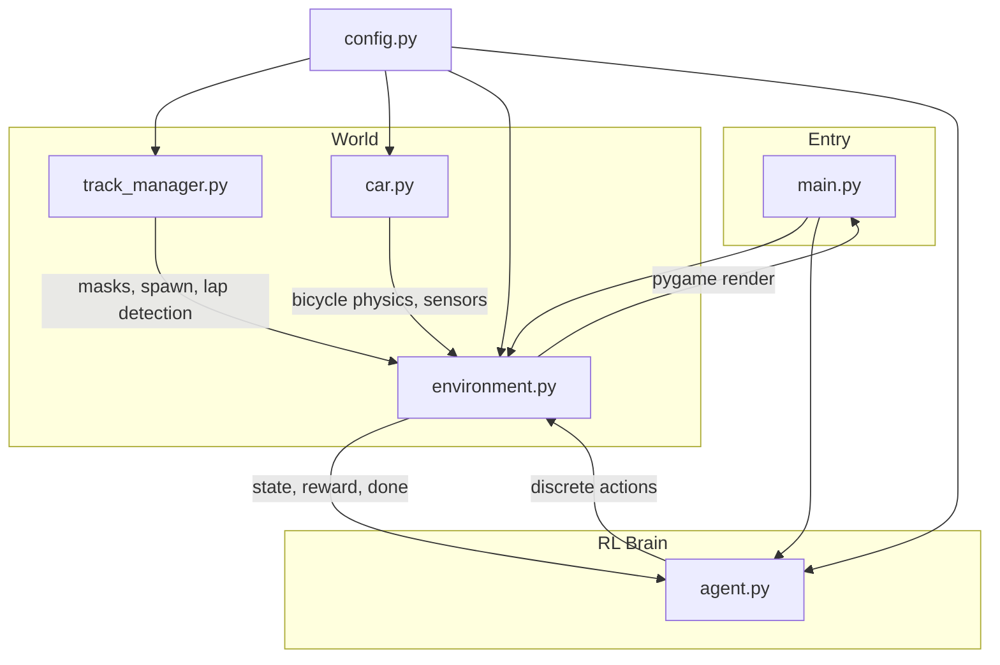

# 2D Self-Driving Car Simulation

A lightweight 2D autonomous driving simulator built with **Python**, **Pygame**, **OpenCV**, and **PyTorch**. Train a reinforcement learning agent to navigate procedurally generated or custom-drawn tracks using computer vision and a kinematic bicycle model.

## Features

- **Dual track system** — procedural closed-spline tracks or user-drawn PNG maps
- **Kinematic bicycle physics** — realistic steering, acceleration, and braking
- **Vision-based perception** — OpenCV preprocessing and CNN-ready frame stacks (Phase 2+)
- **RL training** — Deep Q-Network (DQN) agent for discrete driving actions (Phase 3)

## Tech Stack

| Layer | Library |
|-------|---------|
| Simulation & UI | Pygame |
| Vision | OpenCV, NumPy |
| Machine Learning | PyTorch |

## Project Structure

```text
car-driving-sims/
├── config.py           # Hyperparameters and physics constants
├── main.py             # Entry point (manual / train / play modes)
├── car.py              # Vehicle kinematics and sensors
├── environment.py      # Pygame wrapper, collisions, rewards (Phase 3)
├── track_manager.py    # Procedural splines & PNG track parsing
├── agent.py            # PyTorch DQN / PPO (Phase 3)
├── assets/             # Track images and other media
│   └── track.png       # Default custom track (white road, black walls, green start/finish)
├── requirements.txt
└── STEPS.md            # Detailed design and implementation notes
```

## Architecture



## Requirements

- **Python 3.10+** (developed and tested with 3.13)
- Dependencies listed in `requirements.txt`

## Setup

```bash
# Clone the repository
git clone https://github.com/<your-username>/car-driving-sims.git
cd car-driving-sims

# Create and activate virtual environment
python -m venv .venv

# Windows (PowerShell)
.\.venv\Scripts\Activate.ps1

# macOS / Linux
source .venv/bin/activate

# Install dependencies
pip install -r requirements.txt
```

## Usage

### Manual driving (Phase 1)

Drive with the keyboard on a PNG or procedurally generated track:

```bash
python main.py --mode manual
```

| Key | Action |
|-----|--------|
| `W` | Accelerate |
| `S` | Brake / reverse |
| `A` | Steer left |
| `D` | Steer right |
| `R` | Reset to start line |
| `ESC` | Quit |

### Track options

```bash
# Default PNG track (assets/track.png)
python main.py --mode manual

# Custom PNG track
python main.py --mode manual --track path/to/my_track.png

# Procedural random track
python main.py --mode manual --track procedural
```

### PNG track color contract

When drawing a custom track image, use these exact colors:

| Color | RGB | Meaning |
|-------|-----|---------|
| White | `(255, 255, 255)` | Driveable road |
| Black | `(0, 0, 0)` | Walls / obstacles |
| Green | `(0, 255, 0)` | Start / finish line |

## Development Phases

| Phase | Status | Scope |
|-------|--------|-------|
| **1 — Sandbox** | In progress | Config, track loading, manual WASD driving |
| **2 — Sensors** | Planned | Raycasting, OpenCV frame stack preview |
| **3 — RL Loop** | Planned | Environment, DQN agent, training & inference |

See [STEPS.md](STEPS.md) for physics equations, reward design, and neural network architecture.

## License

MIT — see [LICENSE](LICENSE) if present, or add your preferred license.
